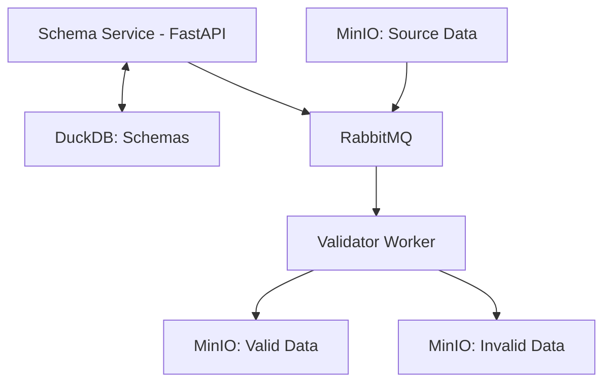

# Data Platform - Gerenciamento de Schema com Pipeline de Ingestão

## Visão Geral

Desafio técnico: gerenciamento de schemas em ecossistema de dados distribuído. A arquitetura utiliza **FastAPI** para o serviço de schemas, **RabbitMQ** para mensageria e **DuckDB** para armazenamento.

### Arquitetura do Sistema



---

## Serviço de Schemas (FastAPI)

### Conceito de Namespace
Um namespace permite organizar schemas de forma lógica, permitindo diferentes critérios de agrupamento:
- **Por data**: `rfb.2025.05.03`, `rfb.2025.05.04`
- **Por formato**: `rfb.json`, `rfb.parquet`
- **Por versão**: `rfb.v1`, `rfb.v2`

### Endpoints da API

| Método | Rota | Descrição |
|--------|------|-----------|
| `PUT` | `/schema` | Insere/atualiza schema para um namespace |
| `GET` | `/schema/namespace/{namespace}` | Obtém schema específico |
| `DELETE` | `/schema/{namespace}` | Remove schema do namespace |
| `POST` | `/job/validate/namespace/{namespace}` | Dispara validação em lote |
| `GET` | `/metrics` | Métricas de operação |


Os dados devem ser inseridos respeitando o formato .avsc (formato schema avro)

**Exemplo de inserção de schema:**
```bash
curl -X PUT "http://localhost:8000/schema" \
  -H "Content-Type: application/json" \
  -d '{
    "namespace": "rfb.2025.05.03",
    "schema": {
      "type": "object",
      "properties": {
        "cnpj": {"type": "string"},
        "razao_social": {"type": "string"},
        "data_abertura": {"type": "string", "format": "date"}
      },
      "required": ["cnpj"]
    }
  }'
```

## Pipeline de Validação

### Fluxo de Processamento
1. **Produção**: O Evento para validação é enviado para a fila RabbitMQ
2. **Consumo**: Worker consome mensagens da fila
3. **Validação**: Dados são validados contra schema registrado. pegando usualmente o último schema inserido (o histórico é mantido)
4. **Armazenamento**:
   - Dados válidos → Tabela `valid_data`
   - Dados inválidos → Tabela `invalid_data` com motivo da falha

### Estratégia de Compatibilidade
- Verificação de campos obrigatórios
- Validação de tipos de dados
- Compatibilidade forward/backward
- Registro de métricas de sucesso/falha

---

## Execução do Projeto

### Pré-requisitos
- Docker
- Docker Compose

### Comandos de Deploy
```bash
# Build e execução completa
docker-compose up --build

# Execução em background
docker-compose up -d
```

### Verificação dos Serviços
- **Schema Service API**: http://localhost:8000/docs
- **RabbitMQ Management**: http://localhost:15672 (guest/guest)
- **Métricas**: http://localhost:8000/metrics

---

## Estrutura do Projeto
A estrutura do projeto é inspirado no padrão DDD.


---

## Desenvolvimento
Para desenvolvimento local:
```bash
# Instalar dependências
uv sync
```